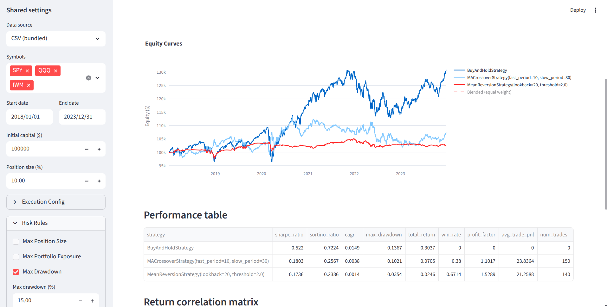
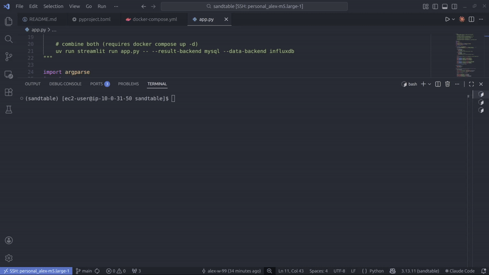

# sandtable

[](https://github.com/westimator/sandtable/actions/workflows/tests.yml)

Event-driven backtesting for systematic trading strategies. Events are processed in strict timestamp order via a priority queue (`MARKET_DATA → SIGNAL → ORDER → FILL`). The data handler only exposes historical data up to the current bar, and orders are filled with configurable slippage, market impact, and commissions.



## Installation

```bash
pip install sandtable
```

See [sandtable on PyPI](https://pypi.org/project/sandtable/) for available versions.

### Development setup

Requires Python 3.13+ and [uv](https://docs.astral.sh/uv/).

```bash
git clone https://github.com/westimator/sandtable.git
cd sandtable
uv sync
```

### Docker services (optional)

[MySQL](https://en.wikipedia.org/wiki/MySQL) is available via Docker Compose for result persistence. This is optional; SQLite works out of the box with no external services.

Requires the [Docker Compose plugin](https://docs.docker.com/compose/install/). If `docker compose version` prints an error, install the plugin:

```bash
# install the plugin
sudo mkdir -p /usr/local/lib/docker/cli-plugins
sudo curl -SL https://github.com/docker/compose/releases/latest/download/docker-compose-linux-x86_64 \
  -o /usr/local/lib/docker/cli-plugins/docker-compose
sudo chmod +x /usr/local/lib/docker/cli-plugins/docker-compose

# verify
docker compose version
```

Then start services:

```bash
# start in background
docker compose up -d

# stop services (data is preserved in Docker volumes)
docker compose down
```

This starts:
- MySQL 8.0 on port 3306 (user: `sandtable`, password: `sandtable`, database: `sandtable`)

## Getting started

### Run the demo

Runs a full showcase with zero arguments - data loading, strategy backtests with realistic execution, risk management, parameter sweeps, walk-forward analysis, statistical significance tests, strategy comparison, persistence, and PDF report generation. Reports are saved to `output/`, results persisted to `sandtable.db`.

```bash
# default: SQLite result store, in-memory data from bundled CSVs
uv run python demo.py

# use MySQL for result persistence (requires docker compose up -d)
uv run python demo.py --store mysql
```

### Launch the dashboard

```bash
# default: SQLite result store, in-memory data from bundled CSVs
uv run streamlit run app.py

# use MySQL for result persistence (requires docker compose up -d)
uv run streamlit run app.py -- --result-backend mysql

# see all options (connection params, db path, etc.)
uv run streamlit run app.py -- --help
```

Opens a local Streamlit dashboard at `http://localhost:8501` with five pages:

1. Backtest: Run a single strategy backtest with configurable execution and risk parameters.
2. Sweep: Parameter grid search with results table and 2D heatmap.
3. Walkforward: Walk-forward analysis with per-fold metrics and stitched OOS equity curve.
4. Compare: Side-by-side strategy comparison with overlaid equity curves and correlation matrix.
5. Runs: Browse, inspect, and manage persisted runs.

Backend configuration (result store) is set once at startup via CLI flags and shown read-only on the Home page. Per-run settings (strategy, data source, symbols, dates, execution, risk) are configured in the sidebar.



## Python API

### One-liner backtest

```python
from sandtable import (
    run_backtest, AbstractStrategy, SignalEvent,
    MarketDataEvent, Direction, FixedSlippage,
    DataHandler, CSVProvider,
)

class MyStrategy(AbstractStrategy):
    def generate_signal(self, bar: MarketDataEvent) -> SignalEvent | None:
        closes = self.get_historical_closes(20, symbol=bar.symbol)
        if len(closes) < 20:
            return None
        mean = sum(closes) / len(closes)
        if bar.close < mean * 0.98:
            return SignalEvent(
                timestamp=bar.timestamp, symbol=bar.symbol,
                direction=Direction.LONG, strength=1.0,
            )
        return None

data = DataHandler(provider=CSVProvider("data/fixtures"), universe=["SPY"])
data.load("2018-01-01", "2023-12-31")

result = run_backtest(
    strategy=MyStrategy(),
    data=data,
    slippage=FixedSlippage(bps=5),
    commission=0.005,
)
print(result.metrics)
```

### Parameter sweep

```python
from sandtable import Metric, run_parameter_sweep, MeanReversionStrategy

sweep = run_parameter_sweep(
    strategy_class=MeanReversionStrategy,
    param_grid={"lookback": [10, 20, 30], "threshold": [1.5, 2.0, 2.5]},
    data=data,
    metric=Metric.SHARPE_RATIO,
)
print(sweep.best_params)
print(sweep.to_dataframe())
```

### Walk-forward analysis

```python
from sandtable import run_walkforward, MACrossoverStrategy

wf = run_walkforward(
    strategy_cls=MACrossoverStrategy,
    param_grid={"fast_period": [5, 10, 15], "slow_period": [20, 30, 40]},
    data=data,
    train_window=252,
    test_window=126,
    optimization_metric=Metric.SHARPE_RATIO,
)
print(f"OOS Sharpe: {wf.oos_sharpe:.2f}")
```

### Risk management

```python
from sandtable import (
    RiskManager, MaxLeverageRule, MaxDrawdownRule,
    MaxDailyLossRule, MaxPositionSizeRule,
)

risk_manager = RiskManager(rules=[
    MaxLeverageRule(max_leverage=2.0),
    MaxDrawdownRule(max_drawdown_pct=0.15),
    MaxDailyLossRule(max_daily_loss_pct=0.03),
    MaxPositionSizeRule(max_position_pct=0.25),
])

result = run_backtest(
    strategy=MyStrategy(),
    data=data,
    risk_manager=risk_manager,
)
```

### Statistical significance

```python
sig = result.significance_tests(n_simulations=1000, random_seed=42)
for name, sr in sig.items():
    print(f"{name}: p={sr.p_value:.4f} {'*' if sr.is_significant else ''}")
```

### Persistence

```python
from sandtable import SQLiteResultStore

store = SQLiteResultStore("sandtable.db")

# auto-persist during backtest
result = run_backtest(strategy=MyStrategy(), data=data, result_store=store)

# browse runs
for run in store.list_runs(min_sharpe=1.0):
    print(f"{run.strategy_name}: Sharpe={run.sharpe_ratio:.2f}")

# reload a run
config, result = store.load_run(run.run_id)
```

MySQL is a drop-in replacement:

```python
from sandtable import MySQLResultStore

store = MySQLResultStore(
    host="localhost",
    port=3306,
    user="sandtable",
    password="sandtable",
    database="sandtable",
)
```

### Reports

```python
from sandtable import generate_pdf_tearsheet, generate_risk_report, generate_comparison_report

generate_pdf_tearsheet(result, output_path="tearsheet.pdf")
generate_risk_report(result, output_path="risk_report.pdf")
generate_comparison_report(
    {"Strategy A": result_a, "Strategy B": result_b},
    output_path="comparison.pdf",
)
```

## How it works

The core is an event loop. On each bar the `DataHandler` emits a `MarketDataEvent`, the strategy decides whether to emit a `SignalEvent`, the portfolio sizes it into an `OrderEvent`, the risk manager approves/resizes/rejects it, and the execution simulator fills it as a `FillEvent` with slippage, spread, and commission applied. All events are frozen dataclasses. The queue is a heap sorted by `(timestamp, priority)` so events at the same timestamp always process in the right order.

Three orthogonal enums control where data comes from and where it goes:

| Enum | Values | Purpose |
|---|---|---|
| `DataSource` | `csv`, `yfinance` | where market data originates |
| `DataBackend` | `memory` | where market data lives at query time |
| `ResultBackend` | `sqlite`, `mysql` | where backtest results are persisted |

### Event types

| Event | Key fields | Emitted by | Consumed by |
|---|---|---|---|
| `MarketDataEvent` | symbol, timestamp, OHLCV | DataHandler | Strategy, Portfolio |
| `SignalEvent` | symbol, direction, strength | Strategy | Portfolio |
| `OrderEvent` | symbol, direction, quantity, order_type | Portfolio (after risk check) | ExecutionSimulator |
| `FillEvent` | symbol, fill_price, commission, slippage, market_impact | ExecutionSimulator | Portfolio |
| `RiskBreachEvent` | rule_name, action, breach_value, threshold | RiskManager | logged, not queued |

### Execution models

```python
from sandtable.execution import (
    ExecutionConfig, ExecutionSimulator,
    ZeroSlippage, FixedSlippage, SpreadSlippage,
    NoMarketImpact, SquareRootImpactModel,
)

# no transaction costs (unrealistic baseline)
executor = ExecutionSimulator(
    slippage_model=ZeroSlippage(),
    impact_model=NoMarketImpact(),
)

# realistic costs
executor = ExecutionSimulator(
    config=ExecutionConfig(
        commission_per_share=0.005,
        commission_minimum=1.0,
    ),
    slippage_model=FixedSlippage(bps=5),
    impact_model=SquareRootImpactModel(eta=0.1),
)
```

### Risk rules

Seven composable rules sit between signal generation and order submission:

| Rule | What it does |
|---|---|
| `MaxPositionSizeRule` | caps single-position value as fraction of equity |
| `MaxPortfolioExposureRule` | caps gross portfolio exposure |
| `MaxLeverageRule` | caps gross exposure / equity ratio |
| `MaxOrderSizeRule` | hard reject on orders exceeding a quantity limit |
| `MaxDailyLossRule` | blocks all trading after intraday loss threshold |
| `MaxDrawdownRule` | halts strategy permanently after drawdown threshold |
| `MaxConcentrationRule` | caps single-position value as fraction of gross exposure |

All rejections and resizes are logged as `RiskBreachEvent` records.

### Metrics

| Category | Metrics |
|----------|---------|
| Returns | `total_return`, `cagr` |
| Risk | `sharpe_ratio`, `sortino_ratio`, `max_drawdown` |
| Trades | `num_trades`, `win_rate`, `profit_factor`, `avg_trade_pnl` |

## Project structure

```
sandtable/
├── src/sandtable/
│   ├── core/           # events, event queue, backtest engine, result
│   ├── strategy/       # AbstractStrategy, MA crossover, mean reversion, buy-and-hold
│   ├── portfolio/      # position tracking, cash, equity curve, P&L
│   ├── execution/      # slippage, spread, market impact, commissions
│   ├── risk/           # risk manager, 7 composable rules, VaR
│   ├── data/           # Instrument, Equity, Future, Universe, TradingHours
│   ├── data_engine/    # CSV/YFinance providers, caching, DataHandler
│   ├── data_types/     # DataSource, DataBackend, ResultBackend, Metric enums
│   ├── research/       # parameter sweeps, walk-forward, strategy comparison
│   ├── stats/          # permutation test, t-test, block bootstrap
│   ├── metrics/        # Sharpe, Sortino, CAGR, drawdown, trade stats
│   ├── persistence/    # SQLite and MySQL result stores
│   ├── report/         # HTML tearsheet and comparison
│   ├── reporting/      # PDF tearsheet, TCA, risk reports
│   ├── viz/            # matplotlib charts, animation
│   ├── ui/             # shared Streamlit components
│   ├── utils/          # logging, exceptions, CLI helpers
│   ├── api.py          # run_backtest(), run_parameter_sweep()
│   └── config.py       # Settings with BACKTESTER_* env var backing
├── pages/              # Streamlit pages (Backtest, Sweep, Walkforward, Compare, Runs)
├── tests/unit/         # 380+ tests
├── data/fixtures/      # bundled CSVs (SPY, QQQ, IWM, AAPL, MSFT 2018-2023)
├── demo.py             # full-feature showcase script
├── app.py              # Streamlit entry point
├── docker-compose.yml  # MySQL 8
└── pyproject.toml
```

## Running tests

```bash
uv run pytest tests/ -q          # all tests
uv run pytest tests/ -v          # verbose
uv run pytest tests/unit/strategy/test_ma_crossover.py -v  # single file
uv run ruff check .              # lint
```

## Further reading

- [Backtesting](https://en.wikipedia.org/wiki/Backtesting)
- [Event-driven architecture](https://en.wikipedia.org/wiki/Event-driven_architecture)
- [Moving average crossover](https://en.wikipedia.org/wiki/Moving_average_crossover)
- [Mean reversion](https://en.wikipedia.org/wiki/Mean_reversion_(finance))
- [Sharpe ratio](https://en.wikipedia.org/wiki/Sharpe_ratio)
- [Walk-forward analysis](https://en.wikipedia.org/wiki/Walk_forward_optimization)
- [Value at Risk](https://en.wikipedia.org/wiki/Value_at_risk)

## License

See [LICENSE](LICENSE) file.
